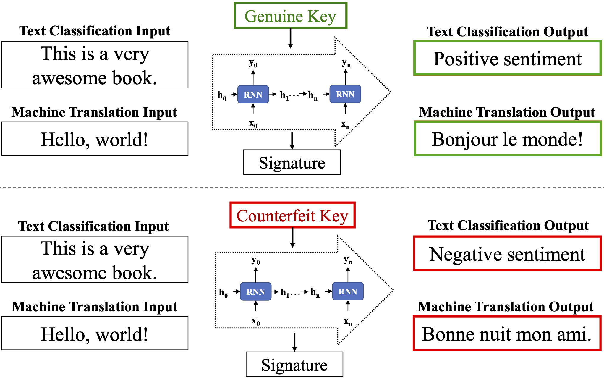

# Recurrent Neural Network IPR Protection

AACL IJCNLP 2022 | <a href="https://arxiv.org/abs/2210.00743">PDF</a>

### Official pytorch implementation of the paper: 
#### - An Embarrassingly Simple Approach for Intellectual Property Rights Protection on Recurrent Neural Networks
#### (Released 26 September 2022)

### Others similar work
1. Our framework on GAN IP protection (CVPR, 2021) is available at [here](https://github.com/dingsheng-ong/ipr-gan).
2. Our framework on DNN IP protection (TPAMI, 2022) is available at [here](https://github.com/kamwoh/DeepIPR).
3. Our framework on Multi-modal IP protection (PR, 2022) is available at [here](https://github.com/jianhanlim/ipr-imagecaptioning).

## Description
<p align="justify">
Capitalise on deep learning models, offering Natural Language Processing (NLP) solutions as a part of the Machine Learning as a Service (MLaaS) has generated handsome revenues. At the same time, it is known that the creation of these lucrative deep models is non-trivial. Therefore, protecting these inventions’ intellectual property rights (IPR) from being abused, stolen and plagiarized is vital. This paper proposes a practical approach for the IPR protection on recurrent neural networks (RNN) without all the bells and whistles of existing IPR solutions. Particularly, we introduce the Gatekeeper concept that resembles the recurrent nature in RNN architecture to embed keys. Also, we design the model training scheme in a way such that the protected RNN model will retain its original performance iff a genuine key is presented. Extensive experiments showed that our protection scheme is robust and effective against ambiguity and removal attacks in both white-box and blackbox protection schemes on different RNN variants.
</p>

<p align="center"></p>
<p align="center">Figure 1: Overview of our proposed protection scheme in white/black box settings.</p>

## Dataset
Most of the datasets will be automatically downloaded except those used in machine translation task as the files are too large to be included directly.

To download and process WMT-14 translation dataset:
1. Download and concatenate all parallel corpora of EN-FR from [WMT14](http://statmt.org/wmt14/translation-task.html).
2. Download testing dataset `newstest2014`.
3. Run `python tools/clean_text.py` on both training and testing dataset to process them.

## How to run
Install required libraries by running `pip install -r requirements.txt` or `conda env create -f conda_env.yml && conda activate ipr-rnn`.

To see more arguments, run the script with `--help`.

Examples below run on default arguments.
### Training baseline (without key)
```
python train_gru_seq2seq.py --output-dir ./outputs/seq2seq/baseline
python train_rnn.py --output-dir ./outputs/trec/lstm/baseline
python train_rnn.py --output-dir ./outputs/mnist/gru/baseline --rnn-type gru --dataset mnist
```

### Training protected model (with key)

```
python train_gru_seq2seq.py --output-dir ./outputs/seq2seq/private --keyed-kwargs ./key_config/seq2seq_config.json
python train_rnn.py --output-dir ./outputs/trec/lstm/private --keyed-kwargs ./key_config/trec_config.json 
python train_rnn.py --output-dir ./outputs/mnist/gru/private --rnn-type gru --dataset mnist --keyed-kwargs ./key_config/mnist_config.json 
```
Set argument `trigger-batch-size` to train with trigger set (black-box).
```
python train_gru_seq2seq.py --output-dir ./outputs/seq2seq/private_trigger --keyed-kwargs ./key_config/seq2seq_config.json --trigger-batch-size 1
```

## Attack
`finetune_*.py`, `overwrite_*.py`, `prune_*.py` and `replace_sign_*.py` are the scripts to run attacks on the protected model.

Please refer to `--help` on how to setup arguments.
Example:
```
python finetune_gru_seq2seq.py --output-dir outputs/seq2seq/ptrigger_trigger_finetune --pretrained-path outputs/seq2seq/private_trigger/
```


## Customizing Keys & Signature
Change the config json files in `key_config/`.
### Key for NLP tasks
Set new json value for `seq2seq_config.json` and `trec_config.json`: `"key": <an array of string or an array of integer array which correspond to the vocabulary index>`
Note for `seq2seq_config.json` set both `enc_key` and `dec_key` parameters.

### Key for sequential image classification task
Set new json value for `mnist_config.json` where `"key": "<directory or path to images as key>"`.

### Signature
Set json value `signature` to the desired signature string. Note that the signature will be truncated if longer than the number of hidden unit. If the signature is longer than the number of hidden units, remaining bits will be set randomly. 

## Citation
If you find this work useful for your research, please cite
```
@inproceedings{RNNIPR,
  title={An Embarrassingly Simple Approach for Intellectual Property Rights Protection on Recurrent Neural Networks},
  author={Tan, Zhi Qin and Wong, Hao Shan and Chan, Chee Seng},
  booktitle={Proceedings of 2nd Conference of the Asia-Pacific Chapter of the Association for Computational Linguistics and the 12th International Joint Conference on Natural Language Processing (AACL/IJCNLP)},
  pages={93--105},
  year={2022},
}
```

## Feedback
Suggestions and opinions on this work (both positive and negative) are greatly welcomed. Please contact the authors by sending an email to
`zhiqin1998 at hotmail.com` or `haoshanw at gmail.com` or `cs.chan at um.edu.my`.

## License and Copyright
The project is open source under BSD-3 license (see the ``` LICENSE ``` file).

&#169;2022 Universiti Malaya.
